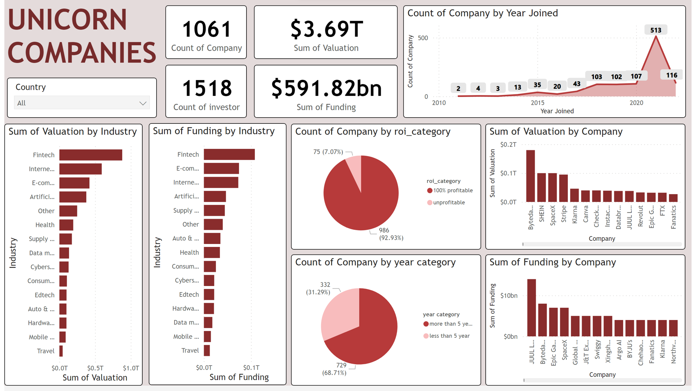

# Unicorn_companies
### **Visualisasi Unicorn Companies**

⛳Deskriptif Masalah

Private companies with a valuation over $1 billion as of March 2022, including each company's current valuation, funding, country of origin, industry, select investors, and the years they were founded and became unicorns.

📌Tujuan:

membuat model regresi yang dapat memprediksi harga penjualan rumah berdasarkan variabel yang ada

## Table of contents
- [Dataset dan Variabel](https://github.com/DiannitaOlipmimi/regresi_dan_asumsinya#step-by-step-analysis)
- [Result](https://github.com/DiannitaOlipmimi/regresi_dan_asumsinya#step-by-step-analysis)
- [Links](https://github.com/DiannitaOlipmimi/regresi_dan_asumsinya#step-by-step-analysis)

## 🧵Dataset dan Variabel
**📒 Data:** 

**Unicorn Companies**
| Company   | Valuation | Date Joined | Industry                        | City          | Country       | Continent     | Year Founded | Funding | Select Investors                                                         |
| --------- | --------- | ----------- | ------------------------------- | ------------- | ------------- | ------------- | ------------ | ------- | ------------------------------------------------------------------------ |
| Bytedance | $180B     | 7/04/2017   | Artificial intelligence         | Beijing       | China         | Asia          | 2012         | $8B     | Sequoia Capital China, SIG Asia Investments, Sina Weibo, Softbank Group  |
| SpaceX    | $100B     | 1/12/2012   | Other                           | Hawthorne     | United States | North America | 2002         | $7B     | Founders Fund, Draper Fisher Jurvetson, Rothenberg Ventures              |
| SHEIN     | $100B     | 3/07/2018   | E-commerce & direct-to-consumer | Shenzhen      | China         | Asia          | 2008         | $2B     | Tiger Global Management, Sequoia Capital China, Shunwei Capital Partners |
| Stripe    | $95B      | 23/01/2014  | Fintech                         | San Francisco | United States | North America | 2010         | $2B     | Khosla Ventures, LowercaseCapital, capitalG                              |
| Klarna    | $46B      | 12/12/2011  | Fintech                         | Stockholm     | Sweden        | Europe        | 2005         | $4B     | Institutional Venture Partners, Sequoia Capital, General Atlantic        |

**📒 Variabel:**

data yang didapatkan merupakan data yang memiliki informasi harga-harga penjualan rumah pada tahun-tahun sebelumnya. data ini memiliki data numerik dan data kategorikal dengan variabel-variabelnya,
- `Company` : nama perusahaan yang telah terdaftar menjadi unicorn
- `Valuation` : nilai asset perusahaan
- `Date Joined` : tanggal perusahaan terdaftar menjadi unicorn
- `Industry` : industri perusahaan
- `City` : kota asal perusahaan
- `Country` : negara asal perusahaan
- `Continent` : benua asal perusahaan
- `Year Founded` : tahun didirikannya perusahaan
- `Funding` : jumlah modal perusahaan
- `Select Investors` : investor yang menanamkan modal kepada perusahaan
- `Year Joined` : tahun perusahaan menjadi unicorn
- `roi` : return of Investment (profitabilitas) perusahaan
- `range` : selisih modal dan nilai asset perusahaan 
- `roi_category` : kategori selisih modal dan nilai asset perusahaan (100% profitable, unprovitable)
- `year category` : kategori selisih tahun perusahaan berdiri dan menjadi unicorn (less than 5 years, more than 5 years)

## 📌**Result**

**📒 Langkah Analisis:**

✅ *Exploratory Data Analysis* (EDA):

1. Melakukan pengecekan apakah terdapat missing data, duplicate data, dan error data
2. Mengambil tahun pada kolom `date joined` dan mengubahnya menjai kolom `year joined`
3. Menghitung selisih tahun didirikannya perusahaan dengan ditetapkannya menjadi unicorn dengan cara mengurangi kolom `year founded` dengan `year joined`
4. Menghitung ROI atau *Return of Investment* dengan cara: `valuation`-`funding`/`funding` 
5. Membuat kolom baru yang berisi kategori ROI yang terbagi menjadi perusahaan telah 100% profitable dan unprofitable
6. Membuat kolom baru yang berisi kategori tahun yang terbagi menjadi less than 5 years dan more than 5 years

**📒 Summary**

✅Valuation Trends: Track the valuation trends of different unicorn companies over time. Highlight the companies that have experienced significant valuation increases or decreases.

✅Industry Distribution: Visualize the distribution of unicorn companies across different industries. Identify which industries have the highest concentration of unicorns.

✅Geographic Distribution: Display the geographic distribution of unicorn companies. Highlight regions or countries with a high number of unicorns.

✅Funding Rounds: Show the number of funding rounds each unicorn company has gone through. Compare the funding rounds' amounts and growth trajectories.

✅Valuation vs. Funding: Analyze the relationship between valuation and funding amounts. Determine if higher funding rounds correspond to higher valuations.

✅Unicorn Birth Year: Display a timeline of when each unicorn company was founded. Identify patterns or trends in the birth years of these companies.

✅Revenue Growth: Showcase the revenue growth of selected unicorn companies. Highlight companies that have achieved substantial revenue increases.

✅User Metrics: If applicable, present user growth metrics, such as active users, registered users, or monthly active users. Identify companies with remarkable user adoption rates.

✅Profitability Status: Highlight whether unicorn companies are profitable or still in the growth phase. This could help investors understand the risk profile of these companies.

✅Exit Strategies: Provide insights into potential exit strategies such as IPOs or acquisitions. Show which companies have taken steps toward these strategies.

✅Leadership Changes: Track changes in executive leadership within unicorn companies. Highlight shifts that could impact company performance.

✅Competitor Analysis: Compare unicorn companies within the same industry. Analyze their valuations, revenue, funding, and growth rates side by side.

✅Market Share: If applicable, showcase the market share of unicorn companies in their respective industries. Identify market leaders and emerging players.

✅Investor Landscape: Visualize the list of investors for each unicorn company. Identify common investors among different unicorns.

✅Employee Growth: Display the growth in the number of employees in unicorn companies. Highlight companies experiencing rapid workforce expansion.

✅Economic Impact: Explore the economic impact of unicorn companies in terms of job creation, innovation, and industry disruption.

## 📌**Links**
📊Dataset by Maven Analytics

https://www.mavenanalytics.io/data-playground?accessType=open&order=fields.numberOfRecords

📊ROI formula

https://www.investopedia.com/articles/basics/10/guide-to-calculating-roi.asp#:~:text=Return%20on%20investment%20(ROI)%20is%20an%20approximate%20measure%20of%20an,finally%2C%20multiplying%20it%20by%20100.